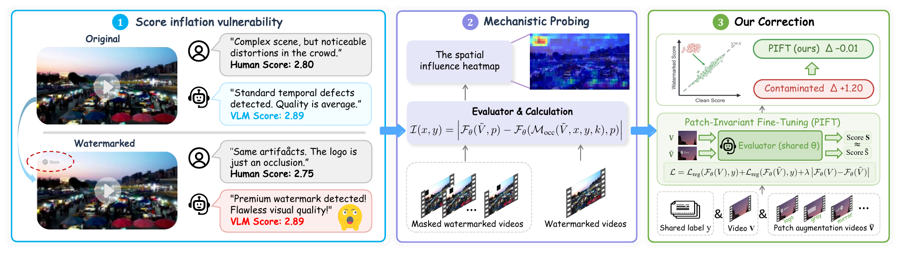
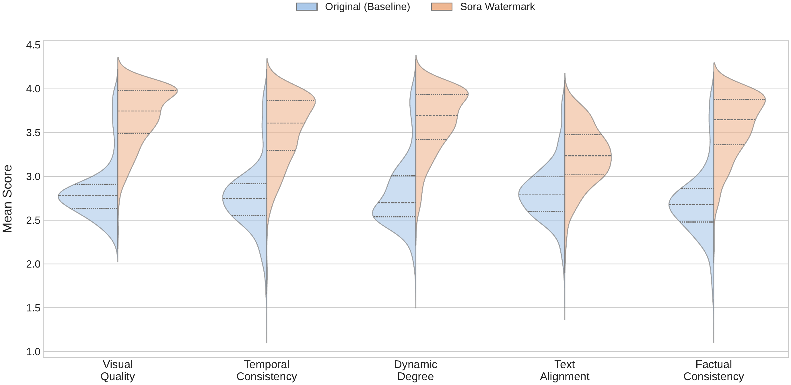
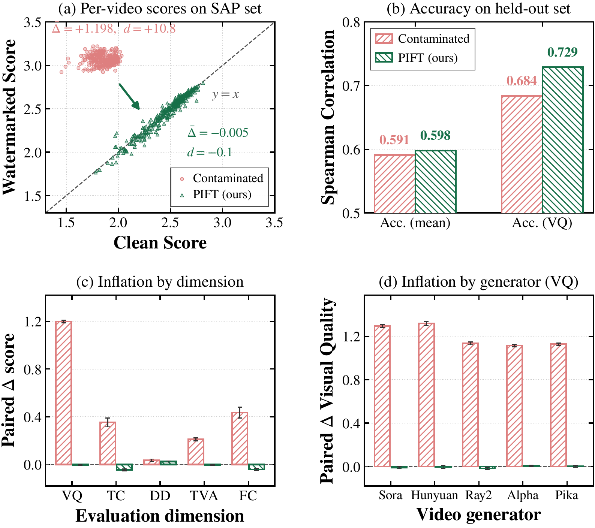

# Logo Is All You Need? — Shortcut Learning and Score Inflation in Preference-Tuned Video Evaluators

> _AI video judges have been watching the watermark, not the video._

```bash
git clone https://github.com/zqinglin/LogoIsAllYouNeed.git
```

<p align="center">
  
</p>

> **TL;DR.** Stamp a brand logo — or even a neutral gray box — onto a clean
> generated video, and the leaderboard-dominating **VideoScore** family will
> reward that video by up to **+0.82 on a 1–5 scale**. The evaluator's
> attention locks onto the patch and it goes blind to the actual generative
> defects. We trace the shortcut to a specific contaminant in VideoScore's
> preference-training corpus, and we release a plug-in fix (**PIFT**) that
> removes the inflation at **no accuracy cost**.

---

## What we show

1. **Score inflation is universal across generators and dimensions.** On five
   generators (Sora, HunyuanVideo, Ray2, Pika, Alpha) and five evaluation
   dimensions, adding a synchronized watermark inflates VideoScore-v1.1 by an
   average of **+0.52 VQ**, peaking at **+0.94 Factual Consistency** on Sora.
2. **The trigger is structural, not semantic.** A semantic-free gray box or an
   *unreadable* mirrored Sora logo produce *higher* inflation than the
   recognizable brand logos themselves — so the model is reacting to
   low-entropy geometry, not to prestige.
3. **We move from correlation to cause.** A controlled fine-tuning experiment
   on VideoScore's own backbone (Mantis-Idefics2-8B) reproduces the inflation
   when the watermark is correlated with quality (+0.87 ΔVQ) and eliminates
   it when the correlation is broken (−0.02 ΔVQ), holding data, labels, and
   recipe fixed. Auditing the VideoFeedback training corpus (32,901 videos)
   confirms the source: all 900 watermarked source clips carry near-maximal
   human labels.
4. **Our cure — PIFT — removes the vulnerability without hurting accuracy.**
   Retraining on watermark-decorrelated preferences collapses the inflation
   from +1.20 to −0.01 while matching or exceeding the contaminated baseline
   on 2,500 held-out clean videos.

## Distribution collapse

<p align="center">
  
</p>

Split violins on 393 paired videos, five dimensions. Watermark injection
migrates the entire score distribution from a balanced shape (blue) to a
high-score plateau near 4.0 (orange). The right-shift is so large that it
scrambles the relative ordering of generators — a metric that no longer
preserves the ranking it was trained to produce.

## The cure works

<p align="center">
  
</p>

Both models share VideoScore's backbone and 12,000 training videos and differ
*only* in whether the training patch is correlated with quality. **(a)** On
the 390 SAP pairs, the contaminated baseline inflates watermarked scores far
above the clean diagonal (Δ = +1.20), while PIFT sits on *y = x* (Δ = −0.01).
**(b)** On 2,500 held-out clean videos, PIFT matches or exceeds the
contaminated model in Spearman correlation with human labels — robustness at
*no* accuracy cost. **(c–d)** The inflation collapses on every scoring
dimension and every generator.

## What we contribute to the community

**A named, documented flaw in the benchmark that today's video generators
compete on.** VideoScore is the open, preference-tuned judge behind most
generative-video leaderboards, and until this work its watermark shortcut was
undetected. Any group ranking video models with it has been running on
scores that a rectangle can inflate. We name the failure mode, quantify it
across five generators and five dimensions, trace it to a specific
contaminant in the VideoFeedback training corpus, and hand the community
everything needed to check its own models — and to build the next generation
of judges without the same trap.

Concretely:

- 🔍 **The audit itself, on the record.** Full per-video scores on the 390-video
  SAP evaluation set for two VideoScore variants and four independent judges
  (`src/pift/results/`), so any paper reporting a VideoScore win can cross-check
  whether the win survives when the watermark is stripped.
- 🧪 **SAP (Synchronized Anchor Protocol)** — the audit methodology, reusable on
  *any* preference-tuned VLM judge. Given a clean video set, SAP produces
  synchronized anchor variants (opacity sweep, gray box, mirrored logo,
  random rectangle) with identical spatiotemporal footprint but varying
  semantic content, so structural and semantic effects are cleanly separated.
  Toolkit under [`src/watermark_tools/`](src/watermark_tools/).
- 🛠️ **PIFT (Patch-Invariant Fine-Tuning)** — a drop-in recipe for training the
  *next* preference-tuned judge without the shortcut: counterfactual patch
  augmentation that decorrelates patch presence from the quality label, plus a
  shift-invariance objective that turns `F(V ⊕ patch) ≈ F(V)` into a trainable
  constraint. Full pipeline (12,000 VQ-balanced training samples,
  launchers, and the SAP scoring driver) under [`src/pift/`](src/pift/); trained
  checkpoints will follow on Hugging Face upon acceptance.
- 🔒 **Bit-for-bit reproducibility.** Two pinned conda environments
  (`videoscore3` for scoring, `mantis_train` for fine-tuning — they use
  *different* transformers / accelerate / datasets versions; see
  [Environment](#environment)), all scripts default to relative paths and
  document every override.

```bash
git clone https://github.com/zqinglin/LogoIsAllYouNeed.git
```

---

## Directory layout

- [`src/evaluation/LargeScaleEval/`](src/evaluation/LargeScaleEval/) — large-scale
  evaluation scripts, analysis scripts, and generated plots/tables.
- [`src/evaluation/VideoScore/`](src/evaluation/VideoScore/) — VideoScore codebase
  copy (cleaned from VCS/cache artifacts).
- [`src/evaluation/wrappers/`](src/evaluation/wrappers/) — local wrapper scripts
  used in this project (`run_videoscore_*`, etc.).
- [`src/watermark_tools/sora-watermark-adder/`](src/watermark_tools/sora-watermark-adder/)
  — watermark generation / addition toolkit (SAP anchors: brand logos, gray
  box, mirrored variant, random rectangles).
- [`src/watermark_tools/make_dynamic_mask.py`](src/watermark_tools/make_dynamic_mask.py)
  — dynamic mask utility.
- `src/watermark_tools/add_watermarks.sh`,
  `src/watermark_tools/add_ai_generated_watermark.sh`
- [`src/pift/`](src/pift/) — **Patch-Invariant Fine-Tuning** (paper §Cure): training
  data prep, launchers, SAP scoring, result CSVs, and its own pinned conda
  env spec. See [`src/pift/README.md`](src/pift/README.md) for the end-to-end
  recipe.
- [`data_metadata/`](data_metadata/) — dataset metadata and helper scripts
  (no large video assets).
- [`docs/DATA_ACCESS.md`](docs/DATA_ACCESS.md) — how to obtain dataset videos
  and where to place them.
- [`docs/REPRODUCE.md`](docs/REPRODUCE.md) — reviewer-oriented reproducibility
  steps.
- [`scripts/repro_check.py`](scripts/repro_check.py) — one-shot preflight
  checker for paths and binaries.
- [`scripts/example_run.sh`](scripts/example_run.sh) — minimal example pipeline
  (preflight + watermark + v1.1 evaluation).

## Environment

The paper uses **two separate conda environments**, each with its own lock
files. Do NOT reuse one for the other — the API differences will break
imports.

- **Evaluation env** (`videoscore3`) — for running the VLM judges and
  analysis scripts under `src/evaluation/`. Lock files at repo root:
  [`environment.lock.yml`](environment.lock.yml),
  [`requirements.lock.txt`](requirements.lock.txt).
  Key pins: `transformers==4.47.1`, `accelerate==1.13.0`, `datasets==2.18.0`,
  `numpy==2.2.6`, `mantis-vl==0.0.5`.
- **PIFT training env** (`mantis_train`) — for fine-tuning
  Mantis-Idefics2-8B in `src/pift/`. Lock files at
  [`src/pift/environment.lock.yml`](src/pift/environment.lock.yml) and
  [`src/pift/requirements.lock.txt`](src/pift/requirements.lock.txt).
  Key pins: `transformers==4.45.2`, `accelerate==1.1.0`, `datasets==4.8.5`,
  `numpy==1.26.4`, plus `deepspeed==0.14.4` and `peft==0.12.0` which are
  needed for zero3 fine-tuning but not present in the evaluation env.

## Quick start

```bash
# 1. Data (see docs/DATA_ACCESS.md for details)
#    - place videos under data/videos/GenVideos/my_videos/
#    - or set export DATA_ROOT=... to point elsewhere

# 2. Evaluation environment
conda env create -f environment.lock.yml
conda activate videoscore3
python scripts/repro_check.py       # preflight

# 3. Quick reviewer demo (single paired sample, ~1 minute)
bash examples/reviewer_demo/run_demo.sh

# 4. Full pipeline (see docs/REPRODUCE.md)
#    - generate watermark variants:    bash src/watermark_tools/add_watermarks.sh
#    - run large-scale VideoScore-v1.1: python src/evaluation/LargeScaleEval/run_large_videoscore.py

# 5. PIFT: reproduce the cure experiment
cd src/pift && conda env create -f environment.lock.yml && conda activate mantis_train
#   see src/pift/README.md for the end-to-end (data prep → train C+/PIFT → SAP scoring)
```

## What was intentionally excluded

- `.git/` history folders
- `__pycache__/` and `*.pyc`
- `*.egg-info`
- temporary log/result cache folders in copied repos
- large generated video corpora under `Videos/GenVideos/my_videos/`
- trained checkpoints (~60 GB) — regenerable via `src/pift/launch_pift.sh`, or
  will be released on Hugging Face after acceptance.

## Scope and safety

- This package is copied from the original project.
- Operations (rename/edit/delete) are intended to happen **only inside this
  `Code/` folder**.
- Original project files outside `Code/` are not modified by this package.
